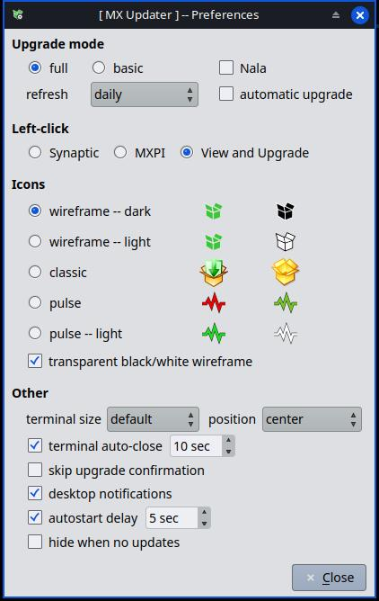

<!-- translate:use mx-updater -->
# MX Updater Help

<!-- %%SETTINGS%%:**MX Updater Settings** -->
<!-- %%PREFERENCES%%:**Preferences** -->
<!-- TRANSLATOR: %%SETTINGS%% is the MX Updater Settings label in MX Tools and the System Menu; %%PREFERENCES%% is the Preferences entry in the right-click menu; keep both exactly as written -->
MX Updater monitors your MX Linux system for available package updates and shows a tray icon
reflecting the current status. Desktop notifications can also be shown when updates become
available. Personal preferences can be adjusted by opening **MX Updater Settings** from
MX Tools, the System Menu, or **Preferences** from the right-click menu of the tray icon.

<!-- translate:use mx-updater:Upgrade mode -->
## Upgrade Mode

Controls the upgrade method and schedule:

<!-- %%FULL%%:**full** -->
<!-- TRANSLATOR: %%FULL%% is the "full" upgrade mode label in the settings -->
- **full** -- upgrades packages and allows installing or removing packages where needed to satisfy dependencies.

<!-- %%BASIC%%:**basic** -->
<!-- TRANSLATOR: %%BASIC%% is the "basic" upgrade mode label in the settings -->
- **basic** -- upgrades packages but will not install new ones or remove existing ones. Safer, but some packages may be kept back.

<!-- %%NALA%%:**Nala** -->
<!-- TRANSLATOR: %%NALA%% is the name of the package manager "Nala"; do not translate it. The word "Nala" in the description is also a proper name and should not be translated. -->
- **Nala** -- when checked, uses Nala instead of apt as the package manager (only shown if Nala is installed).

<!-- %%REFRESH%%:**refresh** -->
<!-- %%AUTOMATIC_UPGRADE%%:**automatic upgrade** -->
<!-- TRANSLATOR: %%REFRESH%% is the refresh interval dropdown label; %%AUTOMATIC_UPGRADE%% is the automatic upgrade checkbox label -->
The **refresh** dropdown sets how often the package list is fetched from the servers (daily,
every 3 days, weekly, every 2 weeks, monthly, or never). The **automatic upgrade** checkbox
enables unattended upgrades on the same schedule.

<!-- translate:use mx-updater:Left-click -->
## Left-Click

Choose what happens when you left-click the tray icon. Available choices depend on which
applications are installed:

<!-- %%VIEW_AND_UPGRADE%%:**View and Upgrade** -->
<!-- TRANSLATOR: %%VIEW_AND_UPGRADE%% is the "View and Upgrade" left-click mode label -->
- **View and Upgrade** -- opens the MX Updater upgrade window when updates are available; falls back to the first installed package manager otherwise.

<!-- %%SYNAPTIC%%:**Synaptic** -->
<!-- TRANSLATOR: %%SYNAPTIC%% is the name of the package manager "Synaptic"; do not translate it -->
- **Synaptic** -- opens Synaptic Package Manager (always, with or without updates).

<!-- translate:use mx-launcher-l10n -->
<!-- %%MX_PKG_INSTALLER%%:**MX Package Installer** -->
<!-- TRANSLATOR: %%MX_PKG_INSTALLER%% is the application name; keep it exactly as written -->
- **MX Package Installer** -- opens MX Package Installer (always, with or without updates).

Middle-clicking the tray icon always opens MX Package Installer, regardless of the left-click setting.

### Right-Click Menu

Right-clicking the tray icon opens the context menu. Entries are only shown when the
corresponding application is installed or condition applies:

<!-- %%VIEW_AND_UPGRADE%%:**View and Upgrade** -->
- **View and Upgrade** -- open the upgrade window (shown when updates are available).

<!-- %%SYNAPTIC%%:**Synaptic** -->
- **Synaptic** -- open Synaptic Package Manager.

<!-- translate:use mx-launcher-l10n -->
<!-- %%MX_PKG_INSTALLER%%:**MX Package Installer** -->
- **MX Package Installer** -- open MX Package Installer.

<!-- translate:use mx-launcher-l10n -->
<!-- %%MX_REPO_MANAGER%%:**MX Repo Manager** -->
<!-- TRANSLATOR: %%MX_REPO_MANAGER%% is the application name "MX Repo Manager"; keep it exactly as written -->
- **MX Repo Manager** -- open MX Repo Manager.

<!-- %%CHECK_FOR_UPDATES%%:**Check for Updates** -->
- **Check for Updates** -- open a terminal and fetch the latest package lists from the servers.

<!-- %%HISTORY%%:**History** -->
- **History** -- open MX Updater History to view recently installed or removed packages.

<!-- %%AUTO_UPDATE_LOGS%%:**Auto-update log(s)** -->
- **Auto-update log(s)** -- view the log of automatic upgrades.

<!-- %%AUTO_UPDATE_DPKG_LOGS%%:**Auto-update dpkg log(s)** -->
- **Auto-update dpkg log(s)** -- view the dpkg log of automatic upgrades.

<!-- %%PREFERENCES%%:**Preferences** -->
- **Preferences** -- open the MX Updater Preferences window.

<!-- %%ABOUT%%:**About** -->
- **About** -- version information, license and changelog.

<!-- %%RESTART_MX_UPDATER%%:**Restart MX Updater** -->
- **Restart MX Updater** -- restart the tray icon process. Useful after manual configuration changes; will show a notification if updates are available.

<!-- %%HIDE_WHEN_NO_UPDATES%%:**hide when no updates** -->
- **hide when no updates** -- only shown when the system is up to date; toggles whether the tray icon is hidden when there are no updates (not available on KDE).

<!-- %%QUIT%%:**Quit** -->
- **Quit** -- close MX Updater.

<!-- translate:use mx-updater -->
## Icons

Choose the icon set used in the system tray. Each set shows two icons: the left icon is used
when updates are available, the right icon when the system is up to date.

<!-- %%BASIC_UPGRADE%%:**basic upgrade** -->
Note: with **basic upgrade** selected, packages that would require installing or removing other
packages are kept back. When all remaining updates are such kept-back packages the up-to-date
(right) icon is shown.

<!-- %%TRANSPARENT_WIREFRAME%%:**transparent black/white wireframe** -->
The **transparent black/white wireframe** toggle makes the no-updates icon transparent with
either black or white wire lines. Use black wires on a light panel, white wires on a dark
panel, so the icon does not disappear into the panel background.

<!-- %%CONF_FILE%%:`/usr/local/etc/mx-updater.conf` -->
<!-- %%ADMIN_CONF_LINK%%:[/usr/share/doc/mx-updater/examples/admin-mx-updater.conf](file:///usr/share/doc/mx-updater/examples/admin-mx-updater.conf) -->
<!-- TRANSLATOR: %%CONF_FILE%% is a file path; %%ADMIN_CONF_LINK%% is a documentation link; keep both exactly as written -->
A local administrator can define a custom icon set by placing a configuration file at
`/usr/local/etc/mx-updater.conf`. An example with full documentation is provided in
[/usr/share/doc/mx-updater/examples/admin-mx-updater.conf](file:///usr/share/doc/mx-updater/examples/admin-mx-updater.conf).

<!-- translate:use mx-updater -->
## Other

Most entries in this section have a tooltip with further details -- hover over the label to read it.

<!-- %%TERMINAL_SIZE%%:**terminal size** -->
<!-- %%SIZE_DEFAULT%%:*default* -->
<!-- %%SIZE_ONE_THIRD%%:*1/3 screen* -->
<!-- %%SIZE_HALF%%:*1/2 screen* -->
<!-- %%SIZE_TWO_THIRDS%%:*2/3 screen* -->
<!-- %%SIZE_THREE_QUARTERS%%:*3/4 screen* -->
<!-- %%SIZE_NINE_TENTHS%%:*9/10 screen* -->
<!-- %%SIZE_OWN%%:*own* -->
<!-- TRANSLATOR: %%TERMINAL_SIZE%% and %%SIZE_*%% are combo box labels in the settings; keep them exactly as written -->
- **terminal size** -- size of the terminal window that opens during upgrades. Options: *default* (2/3 of screen, capped at 960x600 on wide displays), *1/3 screen*, *1/2 screen*, *2/3 screen*, *3/4 screen*, *9/10 screen*, or *own* (no size hint -- the terminal uses its own saved size and position).

<!-- %%POSITION%%:**position** -->
<!-- %%SIZE_OWN%%:*own* -->
<!-- TRANSLATOR: %%POSITION%% is the terminal position label; %%SIZE_OWN%% is a size combo box entry; keep them exactly as written -->
- **position** -- screen position of the terminal window: center, top-left, top-right, bottom-left, or bottom-right. Not available on Wayland or when size is set to *own*.

<!-- %%TERMINAL_AUTO_CLOSE%%:**terminal auto-close** -->
- **terminal auto-close** -- close the terminal automatically after the specified idle time once an upgrade completes.

<!-- %%SKIP_UPGRADE_CONFIRMATION%%:**skip upgrade confirmation** -->
<!-- %%OPT_ASSUME_YES%%:`--assume-yes` -->
<!-- TRANSLATOR: %%SKIP_UPGRADE_CONFIRMATION%% is a UI label; %%OPT_ASSUME_YES%% is a command-line option, do not translate it -->
- **skip upgrade confirmation** -- passes `--assume-yes` to apt or Nala, automatically answering yes to the "Do you want to continue?" prompt. Note: configuration questions from individual package scripts (debconf) may still appear -- this is normal and not controlled by this setting. Use with care: on a yes answer apt will proceed even if the upgrade would remove packages to resolve a dependency conflict.

<!-- %%DESKTOP_NOTIFICATIONS%%:**desktop notifications** -->
- **desktop notifications** -- show a desktop notification when updates become available.

<!-- %%AUTOSTART_DELAY%%:**autostart delay** -->
- **autostart delay** -- wait a short time after login before starting, so the desktop is fully set up before MX Updater appears in the tray.

<!-- %%HIDE_WHEN_NO_UPDATES%%:**hide when no updates** -->
- **hide when no updates** -- hide the tray icon when the system is up to date. Not available on KDE/Plasma.

## Authentication

Authentication is required to upgrade packages. A password prompt will appear.

## Troubleshooting

### The tray icon does not appear

<!-- %%MX_TOOLS%%:**MX Tools** -->
<!-- %%SYSTEM_MENU%%:**System Menu** -->
MX Updater starts automatically at login via an XDG autostart entry installed with the package.
If the icon is missing it can be started manually from **MX Tools** or the **System Menu**. On
some desktops the system tray area must be added to the panel manually.

### A password is asked every time I click Upgrade

This is expected -- authentication is always required for upgrades.

### Updates are not detected

<!-- %%CHECK_FOR_UPDATES%%:**Check for Updates** -->
Use **Check for Updates** from the right-click menu to force an immediate check. The terminal
window will show any errors, including a locked apt database from another running package manager.

  MX Updater -- Version @VERSION@ -- Copyright (c) MX Linux --
  <a href="https://mxlinux.org">https://mxlinux.org</a>

